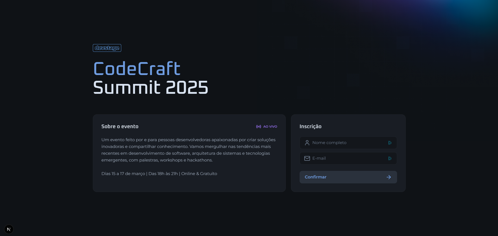
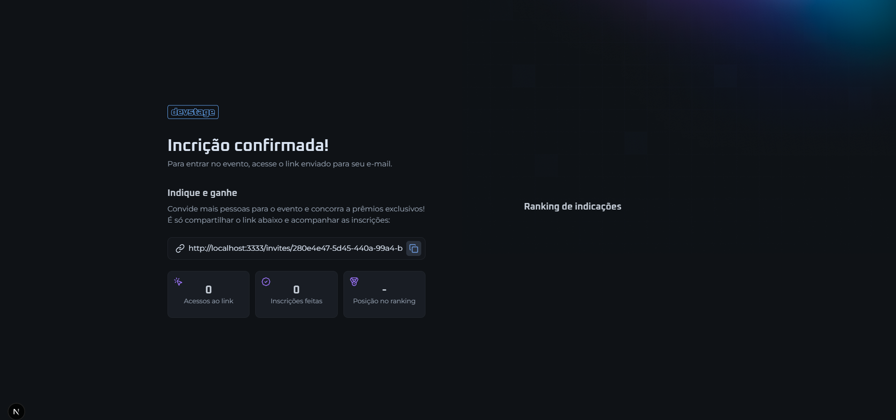
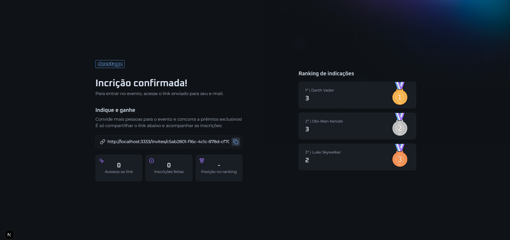

Projeto desenvolvido com [Next.js](https://nextjs.org) | [`create-next-app`](https://nextjs.org/docs/app/api-reference/cli/create-next-app).

## Para começar:

Para iniciar o projeto, você deve rodar o comando:

```bash
npm run dev
# or
yarn dev
# or
pnpm dev
# or
bun dev
```
Abra [http://localhost:3000](http://localhost:3000) no seu navegador para ver o resultado.

## O projeto

Está é a parte do frontend da aplicação, a parte do backend se encontra no repositório [referral-program-backend](https://github.com/patrick-cuppi/referral-program-backend).
O Projeto consiste em um sistema de cadastro para um evento de programação, solicitando nome e e-mail.
Após a confirmação do cadastro, ele gera um link para você convidar outras pessoas, e quando a pessoa faz a inscrição através do seu link,
ele vai gerando uma pontuação, onde há um ranking (os 3 primeiros) com as pessoas que mais tiveram inscritos a partir do seu link.
Quando você acessa a URL da sua inscrição, nela aparecerá também a quantidade de pessoas que abriram seu link, a quantidade de inscrição e seu lugar no ranking.
Abaixo se encontra as telas do projeto:

**Tela para inscrição**


**Inscrição confirmada**


**Ranking**


## Tecnologias utilizadas

Para a construção do projeto, foram utilizadas as seguintes tecnologias:
- TypeScript
- Next.js | React
- Tailwind v.4
- Zod
- Orval

## Abaixo está a documentação oficial do Next.js, assim como a documentação para deploy com o Vercel:

## Learn More

To learn more about Next.js, take a look at the following resources:

- [Next.js Documentation](https://nextjs.org/docs) - learn about Next.js features and API.
- [Learn Next.js](https://nextjs.org/learn) - an interactive Next.js tutorial.

## Deploy on Vercel

The easiest way to deploy your Next.js app is to use the [Vercel Platform](https://vercel.com/new?utm_medium=default-template&filter=next.js&utm_source=create-next-app&utm_campaign=create-next-app-readme) from the creators of Next.js.

Check out our [Next.js deployment documentation](https://nextjs.org/docs/app/building-your-application/deploying) for more details.
